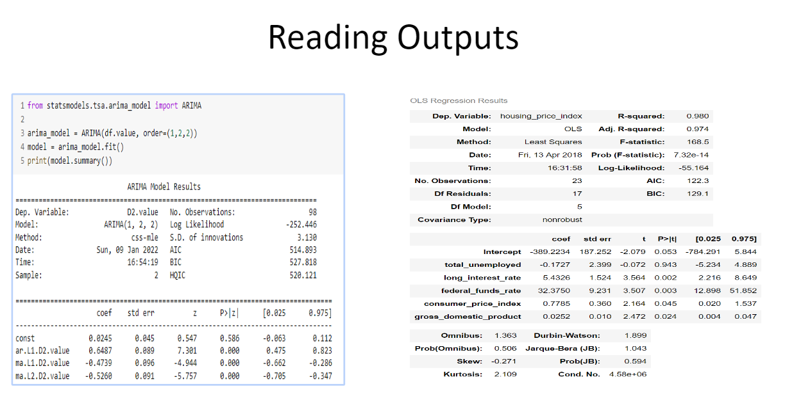
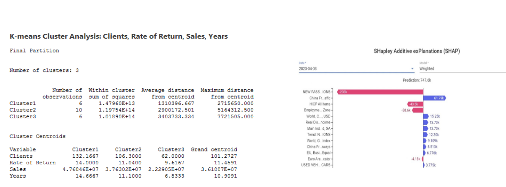

# Session 3 - Machine Learning and Case Studies

### Data Science Case Study: Airline Customer Churn

#### **Pre-Execution Phase**

**Objective Understanding / Product Understanding / Selecting Success Criteria**

1. **Objective Understanding:**
   - Identify the factors leading to customer churn.
   - Develop a predictive model to forecast potential churn customers.
   - Provide actionable insights to retain customers.

2. **Product Understanding:**
   - Understanding the airline services and customer touchpoints.
   - Analyze customer journey from booking to flight completion.
   - Identify high-value customers and their service usage patterns.

3. **Success Criteria:**
   - Reduction in customer churn rate.
   - Increase in customer retention rate.
   - Improvement in overall customer satisfaction and revenue.

**Response Definition:**
   - Response variable: Churn (1 if the customer has churned, 0 otherwise).

**Data Collection & Data Check:**
   - Collect historical data on customer transactions, demographics, and flight details.
   - Ensure data quality, completeness, and consistency.

#### **Approach**

**Response Variable:**
   - Churn

**Customer Selection Criteria:**
   - Customers who have flown at least 2 years in the last 4 years.
   - Customers who haven’t taken a flight in the past year.
   - Average Flight Value (AFV) > $100.
   - Minimum number of flights: 5.

**Data Variables:**

1. **Demographic Features (Customer Oriented):**
   - Age
   - Gender
   - Destination
   - Departure
   - Class
   - Average amount spent
   - Meal preference (opts for meal or not)
   - Rating
   - Average time between flights
   - Average journey time

2. **Transaction Features:**
   - Mode of payment
   - Reward points usage
   - Transaction time

3. **Flight Features:**
   - Timing of flight (morning/afternoon/evening/night)
   - Weekend or weekday flight
   - Average delay
   - Flight duration

### **Data Science Execution**

1. **Data Cleaning / Standardization:**
   - Handle missing values.
   - Standardize formats (e.g., dates, categorical variables).
   - Remove duplicates and irrelevant data.

2. **Outlier Treatment / Missing Value Analysis:**
   - Identify and treat outliers.
   - Impute or handle missing values appropriately.

3. **Aggregations:**
   - Aggregate data to the customer level.
   - Calculate averages, totals, and other relevant statistics.

4. **Exploratory Data Analysis (EDA):**
   - Analyze distributions and relationships between variables.
   - Identify key trends and patterns.
   - Visualize data using graphs and charts.

5. **Splitting:**
   - Split the data into training and testing sets (e.g., 70% training, 30% testing).

6. **Machine Learning Algorithm:**
   - Choose appropriate algorithms (e.g., logistic regression, decision trees, random forests, gradient boosting).
   - Train models using the training dataset.
   - Tune hyperparameters for optimal performance.

7. **Evaluation:**
   - Evaluate model performance using metrics such as accuracy, precision, recall, F1 score, and ROC-AUC.
   - Validate model using the testing dataset.

8. **Sign-Off / Strategy:**
   - Finalize the best-performing model.
   - Develop strategies based on model insights (e.g., targeted marketing, personalized offers).

### **Post Data Science Execution**

1. **Model Deployment:**
   - Deploy the model into a production environment.
   - Integrate with existing systems (e.g., CRM, marketing platforms).

2. **Model Monitoring:**
   - Continuously monitor model performance.
   - Check for model drift and data drift.
   - Update the model as needed to maintain accuracy.

---

This approach ensures a structured and comprehensive analysis of the customer churn problem, leading to actionable insights and a robust predictive model for the airline company.

### How to Prepare a Machine Learning Algorithm

#### **1. Segregate Study into Supervised & Unsupervised Setup, Classification & Regression Setup**

- **Supervised Learning:**
  - **Classification:** Predict discrete labels (e.g., logistic regression, decision trees, random forests, SVMs, neural networks).
  - **Regression:** Predict continuous values (e.g., linear regression, ridge regression, lasso regression, support vector regression).

- **Unsupervised Learning:**
  - **Clustering:** Group data into clusters (e.g., K-means, hierarchical clustering, DBSCAN).
  - **Dimensionality Reduction:** Reduce feature space (e.g., PCA, t-SNE, LDA).

#### **2. Learn About Assumptions of Algorithms**

- **Linear Regression:**
  - Linearity: The relationship between the input and output is linear.
  - Homoscedasticity: Constant variance of errors.
  - Independence: Observations are independent of each other.
  - Normality: Errors are normally distributed.

- **Logistic Regression:**
  - Linearity of independent variables and log odds.
  - Independence of errors.
  - Absence of multicollinearity.

- **Decision Trees:**
  - No assumptions about data distribution.
  - Can handle both numerical and categorical data.

- **K-Means Clustering:**
  - Assumes spherical clusters.
  - Assumes clusters of similar size.

#### **3. Read Theory About the Algorithm**

- Understand the mathematical foundation and working principle.
- Study the algorithm’s derivation and formulation.
- Learn about the typical use cases and application areas.

#### **4. Go to Scikit-learn Documentation Page**

- **Parameters:**
  - Understand the parameters that can be set before model training.
  - Learn about the default values and their significance.

- **Hyperparameters:**
  - Study the hyperparameters that need tuning for optimal performance.
  - Learn about techniques for hyperparameter tuning (e.g., GridSearchCV, RandomizedSearchCV).

#### **5. Implement the Algorithm on at Least One Dataset**

- Choose a dataset (e.g., from UCI Machine Learning Repository, Kaggle).
- **Example Implementation:**

```python
from sklearn.model_selection import train_test_split
from sklearn.linear_model import LogisticRegression
from sklearn.metrics import accuracy_score, confusion_matrix

# Load dataset
# X, y = your data and target

# Split the dataset
X_train, X_test, y_train, y_test = train_test_split(X, y, test_size=0.3, random_state=42)

# Initialize and train the model
model = LogisticRegression()
model.fit(X_train, y_train)

# Make predictions
y_pred = model.predict(X_test)

# Evaluate the model
print("Accuracy:", accuracy_score(y_test, y_pred))
print("Confusion Matrix:\n", confusion_matrix(y_test, y_pred))
```

#### **6. Understand How It Could Be Evaluated**

- **Classification:**
  - Accuracy, precision, recall, F1 score, ROC-AUC, confusion matrix.

- **Regression:**
  - Mean Absolute Error (MAE), Mean Squared Error (MSE), Root Mean Squared Error (RMSE), R-squared.

- **Clustering:**
  - Silhouette score, Davies-Bouldin index, within-cluster sum of squares.

#### **7. Learn About Limitations & Advantages of the Algorithm**

- **Linear Regression:**
  - **Advantages:** Simple to implement, interpretable coefficients.
  - **Limitations:** Assumes linearity, sensitive to outliers.

- **Logistic Regression:**
  - **Advantages:** Works well with binary classification, interpretable results.
  - **Limitations:** Assumes linear relationship between input and log odds, not suitable for non-linear problems.

- **Decision Trees:**
  - **Advantages:** Easy to understand and interpret, handles both numerical and categorical data.
  - **Limitations:** Prone to overfitting, can be unstable with small changes in data.

- **K-Means Clustering:**
  - **Advantages:** Simple to implement, efficient with large datasets.
  - **Limitations:** Requires specification of number of clusters, assumes spherical clusters.

---

Following these steps ensures a thorough understanding and practical implementation of machine learning algorithms, enhancing both theoretical knowledge and practical skills.


### Data Science Case Study: Airline Customer Churn

#### **Pre-Execution Phase**

**Objective Understanding / Product Understanding / Selecting Success Criteria**

1. **Objective Understanding:**
   - Identify the factors leading to customer churn.
   - Develop a predictive model to forecast potential churn customers.
   - Provide actionable insights to retain customers.

2. **Product Understanding:**
   - Understanding the airline services and customer touchpoints.
   - Analyze customer journey from booking to flight completion.
   - Identify high-value customers and their service usage patterns.

3. **Success Criteria:**
   - Reduction in customer churn rate.
   - Increase in customer retention rate.
   - Improvement in overall customer satisfaction and revenue.

**Response Definition:**
   - Response variable: Churn (1 if the customer has churned, 0 otherwise).

**Data Collection & Data Check:**
   - Collect historical data on customer transactions, demographics, and flight details.
   - Ensure data quality, completeness, and consistency.

#### **Approach**

**Response Variable:**
   - Churn

**Customer Selection Criteria:**
   - Customers who have flown at least 2 years in the last 4 years.
   - Customers who haven’t taken a flight in the past year.
   - Average Flight Value (AFV) > $100.
   - Minimum number of flights: 5.

**Data Variables:**

1. **Demographic Features (Customer Oriented):**
   - Age
   - Gender
   - Destination
   - Departure
   - Class
   - Average amount spent
   - Meal preference (opts for meal or not)
   - Rating
   - Average time between flights
   - Average journey time

2. **Transaction Features:**
   - Mode of payment
   - Reward points usage
   - Transaction time

3. **Flight Features:**
   - Timing of flight (morning/afternoon/evening/night)
   - Weekend or weekday flight
   - Average delay
   - Flight duration

### **Data Science Execution**

1. **Data Cleaning / Standardization:**
   - Handle missing values.
   - Standardize formats (e.g., dates, categorical variables).
   - Remove duplicates and irrelevant data.

2. **Outlier Treatment / Missing Value Analysis:**
   - Identify and treat outliers.
   - Impute or handle missing values appropriately.

3. **Aggregations:**
   - Aggregate data to the customer level.
   - Calculate averages, totals, and other relevant statistics.

4. **Exploratory Data Analysis (EDA):**
   - Analyze distributions and relationships between variables.
   - Identify key trends and patterns.
   - Visualize data using graphs and charts.

5. **Splitting:**
   - Split the data into training and testing sets (e.g., 70% training, 30% testing).

6. **Machine Learning Algorithm:**
   - Choose appropriate algorithms (e.g., logistic regression, decision trees, random forests, gradient boosting).
   - Train models using the training dataset.
   - Tune hyperparameters for optimal performance.

7. **Evaluation:**
   - Evaluate model performance using metrics such as accuracy, precision, recall, F1 score, and ROC-AUC.
   - Validate model using the testing dataset.

8. **Sign-Off / Strategy:**
   - Finalize the best-performing model.
   - Develop strategies based on model insights (e.g., targeted marketing, personalized offers).

### **Post Data Science Execution**

1. **Model Deployment:**
   - Deploy the model into a production environment.
   - Integrate with existing systems (e.g., CRM, marketing platforms).

2. **Model Monitoring:**
   - Continuously monitor model performance.
   - Check for model drift and data drift.
   - Update the model as needed to maintain accuracy.

---

This approach ensures a structured and comprehensive analysis of the customer churn problem, leading to actionable insights and a robust predictive model for the airline company.


The image contains two sets of results from different statistical models: an ARIMA model and an OLS regression model. Let's break down and explain each part of these outputs in detail.

### ARIMA Model Results

#### ARIMA Model Code
```python
from statsmodels.tsa.arima_model import ARIMA

arima_model = ARIMA(df.value, order=(1,2,2))
model = arima_model.fit()
print(model.summary())
```

#### ARIMA Model Output
```
ARIMA Model Results
Dep. Variable: D2.value No. Observations: 98
Model: ARIMA(1, 2, 2) Log Likelihood -252.446
Method: css-mle S.D. of innovations 3.130
Date: Sun, 09 Jan 2022 AIC 514.893
Time: 16:54:19 BIC 527.818
Sample: 2 HQIC 520.121
```

#### Interpretation

- **Dep. Variable**: The dependent variable, `D2.value`, indicates the second differenced value of the original data.
- **No. Observations**: The number of observations, which is 98.
- **Model**: Specifies the ARIMA model order `(p,d,q)`, where p=1, d=2, q=2.
- **Log Likelihood**: The log-likelihood of the model, which is -252.446.
- **Method**: The method used for fitting the model, `css-mle` (conditional sum of squares - maximum likelihood estimation).
- **S.D. of innovations**: The standard deviation of the model's residuals, which is 3.130.
- **Date**: The date when the model was run.
- **Time**: The time when the model was run.
- **AIC**: Akaike Information Criterion, which is 514.893. Lower values indicate a better model fit.
- **BIC**: Bayesian Information Criterion, which is 527.818. Lower values indicate a better model fit.
- **HQIC**: Hannan-Quinn Information Criterion, which is 520.121. Lower values indicate a better model fit.
- **Sample**: The sample size, which starts from the second observation because of the differencing.

#### Coefficients Table
```
coef std err z P>|z| [0.025 0.975]
const 0.6245 0.447 1.399 0.162 -0.253 1.502
ar.L1.D2.value 0.6003 0.199 3.017 0.003 0.210 0.991
ma.L1.D2.value -0.6480 0.203 -3.192 0.001 -1.046 -0.250
ma.L2.D2.value -0.5260 0.091 -5.757 0.000 -0.704 -0.348
```

- **coef**: The estimated coefficients for the model.
- **std err**: The standard error of the coefficients.
- **z**: The z-statistic for the hypothesis test.
- **P>|z|**: The p-value for the hypothesis test. Lower values (typically < 0.05) indicate statistical significance.
- **[0.025 0.975]**: The 95% confidence interval for the coefficients.

### OLS Regression Results

#### OLS Model Output
```
OLS Regression Results
Dep. Variable: housing_price_index R-squared: 0.980
Model: OLS Adj. R-squared: 0.974
Method: Least Squares F-statistic: 168.5
Date: Fri, 13 Apr 2018 Prob (F-statistic): 7.32e-14
Time: 16:31:58 Log-Likelihood: -55.164
No. Observations: 23 AIC: 122.3
Df Residuals: 17 BIC: 129.1
Df Model: 5 
Covariance Type: nonrobust
```

#### Interpretation

- **Dep. Variable**: The dependent variable, `housing_price_index`.
- **R-squared**: The coefficient of determination, 0.980, indicating 98% of the variance in the dependent variable is explained by the model.
- **Adj. R-squared**: The adjusted R-squared, 0.974, adjusts the R-squared value for the number of predictors in the model.
- **Model**: Indicates the type of model, which is Ordinary Least Squares (OLS).
- **Method**: The method used for fitting the model, `Least Squares`.
- **F-statistic**: The F-statistic for the model, 168.5.
- **Prob (F-statistic)**: The p-value for the F-statistic, 7.32e-14, indicating the model is statistically significant.
- **Date**: The date when the model was run.
- **Time**: The time when the model was run.
- **Log-Likelihood**: The log-likelihood of the model, -55.164.
- **No. Observations**: The number of observations, 23.
- **AIC**: Akaike Information Criterion, 122.3.
- **Df Residuals**: Degrees of freedom of the residuals, 17.
- **BIC**: Bayesian Information Criterion, 129.1.
- **Df Model**: Degrees of freedom of the model, 5.
- **Covariance Type**: Indicates the type of covariance used, `nonrobust`.

#### Coefficients Table
```
coef std err t P>|t| [0.025 0.975]
Intercept -389.2234 187.252 -2.079 0.053 -784.291 5.844
total_unemployed -0.1727 2.399 -0.072 0.943 -5.234 4.889
long_interest_rate 5.4326 1.524 3.564 0.002 2.216 8.649
federal_funds_rate 32.3750 9.231 3.507 0.003 12.889 51.852
consumer_price_index 0.7785 0.360 2.164 0.045 0.020 1.537
gross_domestic_product 0.0252 0.010 2.472 0.024 0.004 0.047
```

- **coef**: The estimated coefficients for each predictor.
- **std err**: The standard error of the coefficients.
- **t**: The t-statistic for the hypothesis test.
- **P>|t|**: The p-value for the hypothesis test. Values less than 0.05 indicate statistical significance.
- **[0.025 0.975]**: The 95% confidence interval for the coefficients.

#### Additional Statistics
- **Omnibus**: A test for normality of the residuals. A value of 1.363 suggests the residuals are approximately normally distributed.
- **Durbin-Watson**: A test for autocorrelation in the residuals. A value of 1.899 indicates little to no autocorrelation.
- **Prob(Omnibus)**: The p-value for the Omnibus test, 0.506.
- **Jarque-Bera (JB)**: A test for normality. A value of 1.043 suggests the residuals are approximately normally distributed.
- **Skew**: Measures the asymmetry of the residuals, -0.271 indicates slight skewness.
- **Prob(JB)**: The p-value for the Jarque-Bera test, 0.594.
- **Kurtosis**: Measures the peakedness of the residuals, 2.109 indicates approximately normal distribution.
- **Cond. No.**: A measure of multicollinearity in the predictors, 4.58e+06 suggests some multicollinearity.

These outputs provide detailed information about the performance, significance, and diagnostics of the ARIMA and OLS models, respectively.



The image contains two different analyses: a K-means cluster analysis and a SHAP (SHapley Additive exPlanations) plot.

### K-means Cluster Analysis

#### Final Partition
- **Number of clusters**: 3

#### Cluster Details
1. **Cluster 1**
   - **Number of observations**: 6
   - **Within cluster sum of squares**: 1.4796E+13
   - **Average distance from centroid**: 1310396.667
   - **Maximum distance from centroid**: 2715650.000

2. **Cluster 2**
   - **Number of observations**: 10
   - **Within cluster sum of squares**: 1.19754E+14
   - **Average distance from centroid**: 2900172.501
   - **Maximum distance from centroid**: 5164312.500

3. **Cluster 3**
   - **Number of observations**: 6
   - **Within cluster sum of squares**: 1.0189E+14
   - **Average distance from centroid**: 3403733.334
   - **Maximum distance from centroid**: 7721505.000

#### Cluster Centroids
| Variable      | Cluster 1  | Cluster 2  | Cluster 3  | Grand centroid |
|---------------|------------|------------|------------|----------------|
| **Clients**   | 132.1667   | 106.3000   | 62.0000    | 101.2727       |
| **Rate of Return** | 14.0000 | 11.0400 | 9.6167 | 11.4591 |
| **Sales**     | 4.7684E+07 | 3.76302E+07| 2.22905E+07| 3.61887E+07     |
| **Years**     | 14.6667    | 11.1000    | 6.8333     | 10.9091         |

### SHAP (SHapley Additive exPlanations) Plot

The SHAP plot shows the contribution of different features to the model prediction for a specific instance.

#### Features and Contributions
- **NEW PASS ...IONS-3**: -233k (negative contribution)
- **China Fin. ...ffic**: 61.7k (positive contribution)
- **HCP All Items**: -43.5k (negative contribution)
- **Employme ... Zone**: 30.6k (positive contribution)
- **World Co ... USD**: 15.2k (positive contribution)
- **Real Dis ... come**: 13.7k (positive contribution)
- **Man Ind. d ...SA**: 13.7k (positive contribution)
- **Trend N. ...IONS**: 12.3k (positive contribution)
- **World G. ... USD**: 10.9k (positive contribution)
- **China Fi ...ways**: 9.2k (positive contribution)
- **EU Busi. ... Equal**: 8.5k (positive contribution)
- **Euro Are ... cator**: 6.7k (positive contribution)
- **USED VEH ... CARS**: -4.18k (negative contribution)
- **Overall Prediction**: 747.6k

### Summary

- **K-means Cluster Analysis**: This analysis groups data into three clusters based on clients, rate of return, sales, and years. Each cluster has its centroids for the variables, showing the average characteristics of the data points in each cluster.
- **SHAP Plot**: The SHAP plot explains the contributions of different features to the model's prediction. Positive SHAP values indicate features that increase the prediction, while negative values indicate features that decrease the prediction. The overall prediction is 747.6k.


